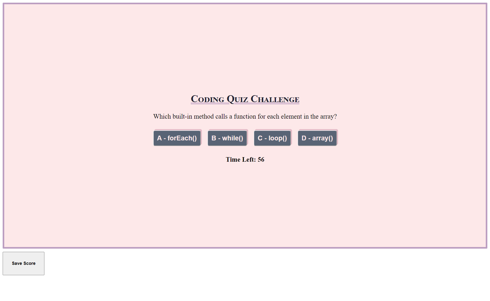

# coded-js-quiz

This is a project incorporating javascript in order to create a timed quiz. Players will answer the multiple choice questions - if correct, points will be added to their score; if incorrect, time will be deducted from the countdown. When the timer expires, players will be able to save their scores in local storage so that they may see them at a later time. 

Acceptance Criteria is below.

---
## Acceptance Criteria

```
GIVEN I am taking a code quiz
WHEN I click the Start button
THEN a timer starts and I am presented with a question
WHEN I answer a question
THEN I am presented with another question
WHEN I answer a question incorrectly
THEN time is subtracted from the clock
WHEN all questions are answered or the timer reaches 0
THEN the game is over
WHEN the game is over
THEN I can save my initials and score
```

The following is a screenshot of the application as well as a link to the deployed application:



### Deployed Application


---
Kris Smith
